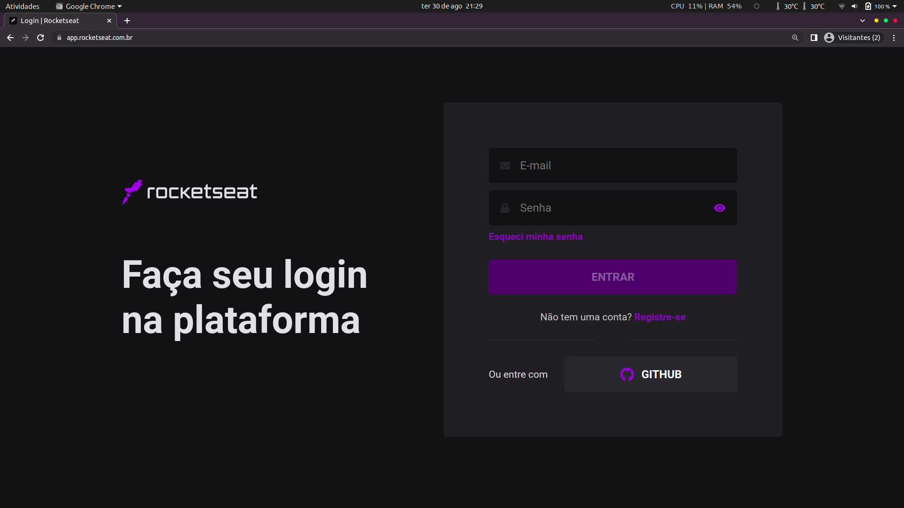
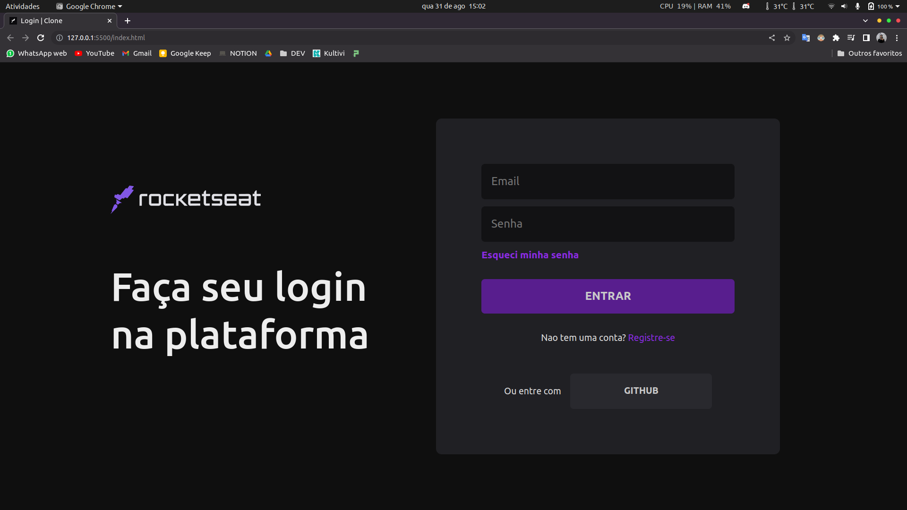

# Login-clone-Rocketseat
Este foi um projeto simples e rápido, com a finalidade de testar minhas habilidades em HTML e CSS puro!

##

## Prints
### Página atual da rocktseat!

  

##

### Página desenvolvida por mim!

 

##

## Descrição completa
- É apenas uma simples cópia, não é 100% fiel a original pois, optei por não adicionar SVGS como a página horiginal
- E também não é uma página responsiva, funcionando apenas em telas 16:9, e com o zoom do browser em 150%
- como não iá ser realizado o deploy de uma página tão simples, irei disponibilizar abaixo um link de um video mostrando a página rodando!

## Video

### Link: https://www.youtube.com/watch?v=3GzLe9eXxjA